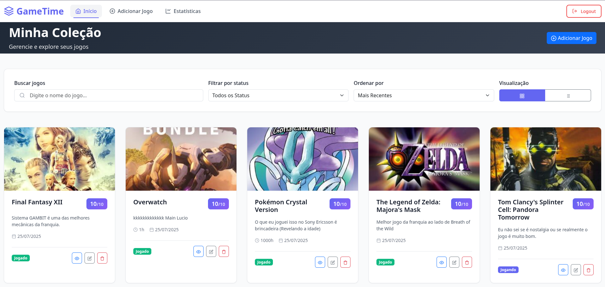
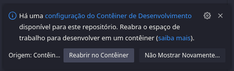

# GameTime

A intenção aqui é apenas ser um projeto único em que eu possa treinar e colocar em prática tudo aquilo que eu veja de novidade e esteja estudando.


*Tela principal do GameTime exibindo a lista dos melhores jogos da história (Majora's Mask tu pode me levar a sério, o resto claramente não)*

---

## Funcionalidades

- **Autenticação de Utilizador**  
  Sistema de registo e login com tokens JWT.

- **Gestão de Coleção (CRUD)**  
  Adicione, visualize, edite e remova jogos.

- **Detalhes do Jogo**  
  Registe informações como nome, nota (de 0 a 10), horas jogadas e uma avaliação pessoal.

- **Estado do Jogo**  
  Classifique os seus jogos como:  
  `JOGADO`, `JOGANDO`, `JOGAREI` ou `BACKLOG`.

- **Integração com IGDB**  
  Obtenha automaticamente a capa do jogo ao adicioná-lo à sua coleção.

- **Filtros e Ordenação**  
  Pesquise jogos por nome, filtre por estado e ordene por nome, nota ou data de adição.

- **Paginação**  
  Navegue facilmente por coleções grandes.

- **Estatísticas do Utilizador**  
  Visualize um "dashboard" com:
  - Total de jogos
  - Jogos zerados
  - Horas jogadas
  - Média das suas notas

---

##  Tecnologias Utilizadas

O projeto é dividido em duas partes principais: **backend** e **frontend**.

### Backend

- Java 21 & Spring Boot 3  
- Spring Data JPA & MySQL/H2  
- Spring Security & JWT  
- Maven  
- Lombok  

### Frontend

- Angular & TypeScript  
- Bootstrap 5 & SCSS  

### DevOps

- Docker & Docker Compose  

---

## Como Começar
***Forma que eu recomendo:*** Use o VS Code e baixe a extensão [Dev Containers](https://marketplace.visualstudio.com/items?itemName=ms-vscode-remote.remote-containers)

Ao abrir o repositório surgirá uma mensagem no canto inferior direito perguntando se deseja abrir a pasta atual no container **ACEITE**.




OOOOOOOOOOU

Você precisará do **Docker** e do **Docker Compose** instalados (No outro modo está tudo mastigado pra você).

### Pré-requisitos

- Credenciais da API do [IGDB/Twitch](https://dev.twitch.tv/console). ***Você precisa dessas chaves*** atualmente para o carregamento das imagens dos jogos, posteriormente será mais necessária ainda devido a novas funcionalidades.
e
- VS Code com Dev Containers
ou
- Docker  
- Docker Compose    

### Instalação e Execução

Clone o repositório:

```bash
git clone https://github.com/Pethoriano/GameTime.git
cd GameTime
```

Configure as variáveis de ambiente:

Este projeto usa um ficheiro .env para gerir as variáveis de ambiente. Tem um ficheiro de exemplo para facilitar:

```bash
cp .env.example .env
```
Edite o ficheiro .env com as suas credenciais reais.

Exemplo de .env:
```env
# Configurações da Base de Dados MySQL
# Pode criar suas senhas imaginárias, sem problemas. Exceto o ID e o Secret do IGDB

MYSQL_ROOT_PASSWORD=sua_senha_root_real
DB_USER=seu_user_real
DB_PASSWORD=sua_senha_real

# JWT
# Pode trocar também
JWT_SECRET=na_sala_ou_no_quarto_no_beco_ou_no_carro

# Credenciais IGDB
# Precisa se cadastrar no https://dev.twitch.tv/console
IGDB_CLIENT_ID=seu_client_id_real_do_igdb
IGDB_CLIENT_SECRET=seu_client_secret_real_do_igdb
```

**⚠️ O .env já está no .gitignore para garantir que as suas senhas e segredos nunca sejam enviados para o repositório.**

Construa e inicie os containers Docker
Na raiz do projeto, execute:

```bash
docker-compose up --build -d
```

**Acesse à aplicação:**

* **No seu Navegador acesse:** http://localhost:4200

## Atualizações Futuras
Aqui algumas coisas que preciso melhorar e features que pretendo adicionar ao longo do tempo (Coloquei em uma "ordem" de prioridade):

* **Corrigir problemas no frontend e melhoras de interface:** O projeto tem bugs no front (nada que não permita o uso principal da aplicação, mas corrigirei). Também pretendo melhorar algumas coisas como a tela de atualização dos jogos.

* **IGDB:** Integrar mais coisas relacionadas ao jogos com o IGDB, como busca automática na hora do cadastro e obter mais infos dos jogos também para a tela de detalhe do jogo que o usuário adicionou.

* **Home descente** Adicionar uma sessão para jogos que estão prestes a serem lançados, os que lançaram no dia que o usuário está usando a aplicação e etc. Já tenho até algumas referências.

* **Lista de Desejos (Wishlist):** Uma seção separada para os jogos que o usuário deseja.

* **Estatísticas Avançadas:** Gráficos mais detalhados, como jogos finalizados por ano e etc. Eu sou o maluco dos dados então isso vai ter bastante.

* **Funcionalidades Sociais:** Adicionar amigos e ver a coleção ou a lista de desejos deles.
